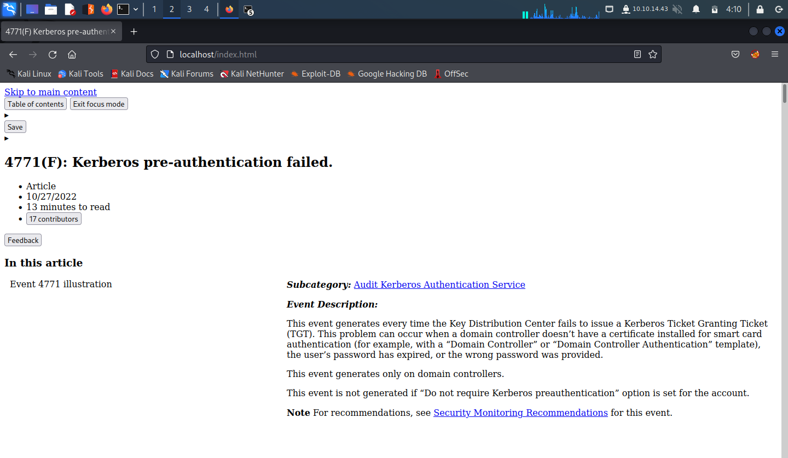

# Summary

<details>
<summary></summary>
	
* [What Are Canary Tokens](#what-are-canary-tokens)
* [Web Example](#example-web-use-case)
* [Word Document Example](#example-word-document-use-case)

</details>

## What Are Canary Tokens?

Canary tokens are a tool for threat hunting/ active cyber defense. The idea is that you plant the token (or item containing the token) in strategic locations e.g. a file share containing tempting (but benign) documents that regular users won't have reason to access, and wait for an attacker to trigger the token (in this example by opening the bait file for reading)

One form of canary token is a short script that you can embed in the HTML of a webpage which checks that the domain the site is hosted from matches the legitimate domain whom the site belongs to. 
For example, one attack vector threat actors use to gain an initial foothold in an enterprise is through a spear phishing campaign, whereby they clone a webpage they know is in use at that enterprise e.g. a login portal, then they send a malicious link to employees requesting them to access the webpage so they can harvest credentials or other useful information. 
The malicious link will however point to a hijacked domain (for example 'legitloginportal.com' becomes 'legitlogonportal.com'). 
So if the enterprise hosting 'legitloginportal.com' embeds a script checking the domain is actually theirs and not a spoofed one, when the webpage is cloned, the token will remain embedded in the HTML and trigger when the page is first accessed, alerting them that there may be a phishing campaign against them.

`WebCanaryTokenScanner.py` checks webpages for canary tokens. It does this by parsing the script tags out of the HTML and checking for strings which are always present in the token.

`DocxCanaryTokenScanner.py` uses the fact that modern office documents `.docx, .xlsx, pptx, .docm etc.` are a zip compressed archive of XML files containing information describing the structure, layout and content of the document. In particular, `.xml.rels` files in the archive describe relationships within the document and with any external resources. For example a hyperlink in the footer of a `.docx` file will be appear in a file `footer.xml` (for example) and a relationship in a `.xml.rels` file will map the footer to the external resource. As such, we can unzip the `.docx` file and parse the `.rels` for links to external resources of interest. 

## Example Web Use Case

I copied the HTML source from <a href="https://learn.microsoft.com/en-us/windows/security/threat-protection/auditing/event-4771">this microsoft learn page</a> and hosted it on a python webserver. I went deep into the HTML and embedded the canary token script:
```
[...snip...]
        </script>
        <script src="https://wcpstatic.microsoft.com/mscc/lib/v2/wcp-consent.js"></script>
        <script src="https://js.monitor.azure.com/scripts/c/ms.jsll-3.min.js"></script>

        <script src="/_themes/docs.theme/master/en-us/_themes/global/67a45209.deprecation.js"></script>
                <script src="/_themes/docs.theme/master/en-us/_themes/scripts/14a90406.index-docs.js"></script>
</head>
<script>
    if (document.domain != "learn.microsoft.com" && document.domain != "www.learn.microsoft.com") {
        var l = location.href;
        var r = document.referrer;
        var m = new Image();
        m.src = "http://canarytokens.com/"+
                "nanmc0qeniyu1azl8ddhtaxyf.jpg?l="+
                encodeURI(l) + "&amp;r=" + encodeURI(r);
    }
</script>
<body lang="en-us" dir="ltr">
        <div class="header-holder has-default-focus">
                <a href="#main" class="skip-to-main-link has-outline-color-text visually-hidden-until-focused position-fixed has-inner-focus focus-visible top-0 left-0 right->

                <div hidden id="cookie-consent-holder"></div>
[...snip...]
```
                                                      
Accessing the site looks like
                                                      
 
                           
And running the script returns
  
 
                           
If the token has been obfuscated, the strings inside the javascript may or may not be hex encoded depending on the level of obfuscation.
Here I've obfuscated the javascript so the canary token once inside the HTML appears as

```
[...snip...]
        </script>
        <script src="https://wcpstatic.microsoft.com/mscc/lib/v2/wcp-consent.js"></script>
        <script src="https://js.monitor.azure.com/scripts/c/ms.jsll-3.min.js"></script>

        <script src="/_themes/docs.theme/master/en-us/_themes/global/67a45209.deprecation.js"></script>
                <script src="/_themes/docs.theme/master/en-us/_themes/scripts/14a90406.index-docs.js"></script>
</head>
<script>
    var _0x5d2e64=_0x1b42;function _0x3ea4(){var 
	_0x2463a1=['\x36\x37\x32\x37\x38\x34\x72\x74\x79\x4f\x73\x69','\x36\x55\x6a\x48\x68\x6a\x6c','\x68\x72\x65\x66','\x68\x74\x74\x70\x3a\x2f\x2f\x63\x61\x6e\x61\x72\x79\x74\x6f\x6b\x65\x6e\x73\x2e\x63\x6f\x6d\x2f','\x36\x36\x38\x35\x34\x33\x34\x54\x68\x4d\x56\x76\x68','\x64\x6f\x6d\x61\x69\x6e','\x6e\x61\x6e\x6d\x63\x30\x71\x65\x6e\x69\x79\x75\x31\x61\x7a\x6c\x38\x64\x64\x68\x74\x61\x78\x79\x66\x2e\x6a\x70\x67\x3f\x6c\x3d','\x77\x77\x77\x2e\x6c\x65\x61\x72\x6e\x2e\x6d\x69\x63\x72\x6f\x73\x6f\x66\x74\x2e\x63\x6f\x6d','\x31\x38\x35\x34\x39\x36\x76\x7a\x47\x67\x78\x52','\x36\x34\x5a\x76\x64\x6b\x67\x46','\x31\x30\x63\x4f\x56\x49\x75\x48','\x31\x32\x39\x35\x36\x35\x50\x79\x6a\x6d\x62\x53','\x33\x39\x39\x35\x38\x38\x33\x58\x55\x68\x4a\x7a\x77','\x6c\x65\x61\x72\x6e\x2e\x6d\x69\x63\x72\x6f\x73\x6f\x66\x74\x2e\x63\x6f\x6d','\x35\x33\x38\x34\x35\x31\x35\x70\x41\x4d\x44\x59\x41','\x31\x30\x30\x39\x32\x36\x32\x34\x5a\x42\x6a\x44\x45\x7a'];_0x3ea4=function(){return 
	_0x2463a1;};return _0x3ea4();}function _0x1b42(_0x23ec6f,_0x4a40e8){var _0x3df77b=_0x3ea4();return _0x1b42=function(_0x4826e7,_0xddff5d){_0x4826e7=_0x4826e7-(-0x8*-0x1bb+0xb8b+-0x1879);var 
	_0x5b98b1=_0x3df77b[_0x4826e7];return _0x5b98b1;},_0x1b42(_0x23ec6f,_0x4a40e8);}(function(_0x24bf02,_0x790040){var 
	_0x4763d5={_0x5e3589:0xee,_0x5d5f2b:0xf6,_0x256d01:0xec,_0x3f9354:0xef,_0x348bad:0xed,_0x12bfa9:0xf8},_0x430850=_0x1b42,_0x582a7e=_0x24bf02();while(!![]){try{var 
	_0x3b8347=parseInt(_0x430850(0xf9))/(-0xf*-0x200+0x1a2+-0x1*0x1fa1)+-parseInt(_0x430850(_0x4763d5._0x5e3589))/(-0x1c*-0x14b+-0xd*0x2c8+0x2*-0x5)+-parseInt(_0x430850(_0x4763d5._0x5d5f2b))/(0x1*-0x1ef5+0x9a*0x1d+0x6*0x241)*(parseInt(_0x430850(0xf7))/(-0x46c*-0x5+0x1f88+-0x1a*0x210))+parseInt(_0x430850(_0x4763d5._0x256d01))/(-0x1*-0x221d+0x1c0b+-0x3e23)*(parseInt(_0x430850(_0x4763d5._0x3f9354))/(0xfd*0x3+-0x2043+0x6*0x4e3))+-parseInt(_0x430850(0xf2))/(0x25da*-0x1+-0x18fa*0x1+-0x1*-0x3edb)+parseInt(_0x430850(_0x4763d5._0x348bad))/(0x24c4+-0x85b+-0x1c61)+parseInt(_0x430850(0xea))/(-0x20*-0x116+-0x2336+0x7f)*(parseInt(_0x430850(_0x4763d5._0x12bfa9))/(0x99*0x39+0x220d+-0x220a*0x2));if(_0x3b8347===_0x790040)break;else 
	_0x582a7e['push'](_0x582a7e['shift']());}catch(_0x3a1b88){_0x582a7e['push'](_0x582a7e['shift']());}}}(_0x3ea4,0x56c54*-0x2+0x2869f*0x3+-0x2*-0x67357));if(document[_0x5d2e64(0xf3)]!=_0x5d2e64(0xeb)&&document['\x64\x6f\x6d\x61\x69\x6e']!=_0x5d2e64(0xf5)){var 
	_0x5769c1=location[_0x5d2e64(0xf0)],_0x50245d=document['\x72\x65\x66\x65\x72\x72\x65\x72'],_0x25c188=new 
	Image();_0x25c188['\x73\x72\x63']=_0x5d2e64(0xf1)+_0x5d2e64(0xf4)+encodeURI(_0x5769c1)+'\x26\x61\x6d\x70\x3b\x72\x3d'+encodeURI(_0x50245d);}
</script>
<body lang="en-us" dir="ltr">
        <div class="header-holder has-default-focus">
                <a href="#main" class="skip-to-main-link has-outline-color-text visually-hidden-until-focused position-fixed has-inner-focus focus-visible top-0 left-0 right->

                <div hidden id="cookie-consent-holder"></div>
[...snip...]
```

And running the script returns

 

Example Word Document Use Case 
----------------------

Consider the file `canary.docx`

 

interesting, I know.

Running `DocxCanaryTokenScanner.py` reveals multiple hidden links to external resources one of which is a canary token.

 

